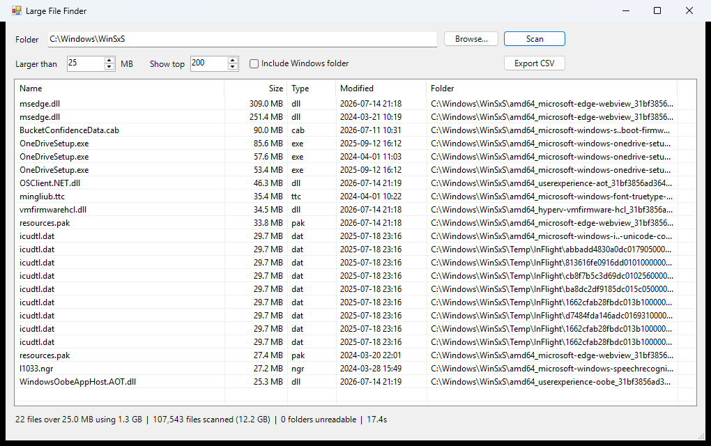

# Large File Finder

Find the biggest files on your PC. One PowerShell script — no install, no dependencies,
nothing to trust but the source you're reading.



## Run it

- **GUI** — double-click `Large File Finder.cmd`
- **Console** — from PowerShell:

> Windows blocks scripts downloaded from the internet. The `.cmd` launcher already
> handles this. To run the `.ps1` directly, unblock it once:
> `Unblock-File .\LargeFileFinder.ps1`

```powershell
.\LargeFileFinder.ps1 -Console -Path C:\Users\You -MinMB 250 -Top 50
.\LargeFileFinder.ps1 -Console -Path C:\ -MinMB 500 -Csv big.csv
```

| Parameter | Meaning | Default |
|---|---|---|
| `-Path` | Folder or drive to scan | your user folder (GUI) / current folder (console) |
| `-MinMB` | Ignore files smaller than this | 100 |
| `-Top` | How many results to show | 200 |
| `-Csv` | Write results to a CSV instead of the screen | — |
| `-IncludeWindows` | Also scan `C:\Windows` | off |
| `-Console` | Terminal output instead of the GUI | off |

## In the GUI

- **Double-click a row** — opens File Explorer with the file selected
- **Right-click** — open folder, copy full path, or delete to the Recycle Bin
- **Click a column header** — sort by name, size, type, date, or folder
- **Export CSV** — save the full result list
- **Scan** turns into **Cancel** while a scan is running

## What it skips

`C:\Windows` (unless `-IncludeWindows`), `$Recycle.Bin`, `System Volume Information`,
`Recovery`, and any junction or symlink — so it never loops or double-counts.
Folders it cannot read are counted and reported, never fatal.

## Performance

A user folder with ~270,000 files scans in about 20 seconds; `C:\Program Files`
(~21,000 files) in about 1 second. A full drive takes a minute or two.

The scan walks the tree iteratively rather than recursively, so depth can't blow the
stack, and it reads sizes straight from the directory enumeration instead of stat-ing
each file again.

## Requirements

Windows with PowerShell 5.1 (built into Windows 10/11). Nothing else.

## Notes

- Deletes go to the Recycle Bin, never a permanent delete.
- The `.cmd` launcher passes `-HideConsole`, which hides only the console window.
  Don't launch it with `-WindowStyle Hidden` — that hides the app window too.

## License

MIT — see [LICENSE](LICENSE).
